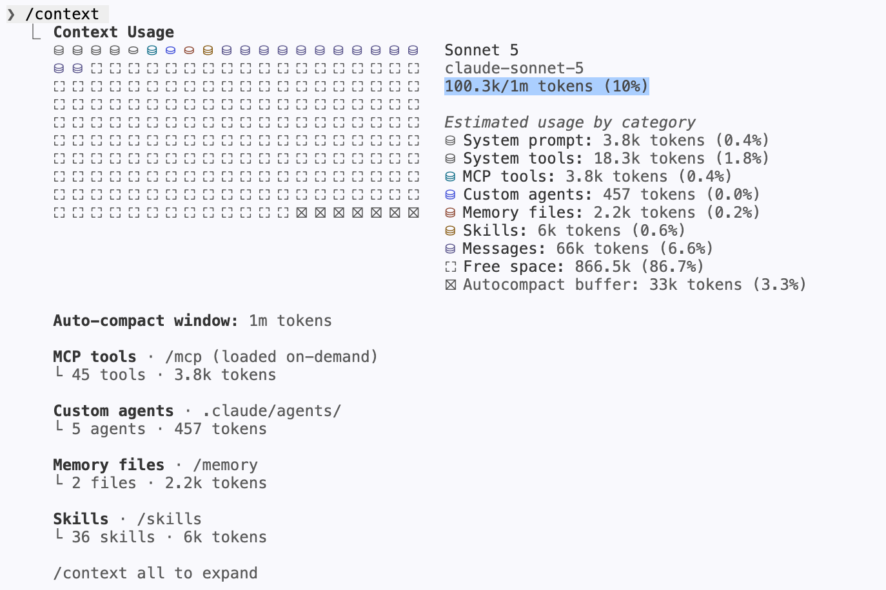
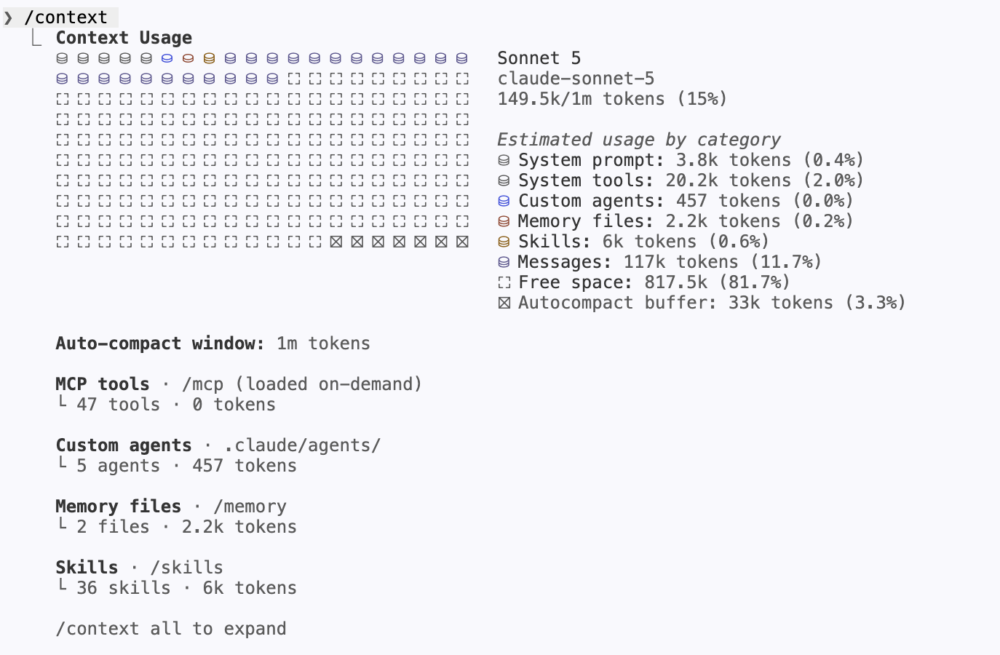

## What I built
 
SLOP3385, *Meets Expectations: Surviving the Performance Review*. As AI gets smarter every year, tech companies are doing layoffs more often than ever. So I built a course that teaches graduating Computer Science students how to survive performance reviews. Each week teaches a trick and why it works. At the end, students design a performance review system that cannot be tricked.
 
## How I got here
 
I started from my week 6 harness ([`02ed8c6`](https://github.com/comp4020-agentic-coding-studio/comp4020-ass2-DongyangLi6816/commit/02ed8c6)) with casual prompts like *"Design a course website that aims for HD."* Even with plan mode, the site was mostly text, like the template with only the words changed.
 
Then I learned to give the AI a role: *"You are a senior course designer and front-end engineer..."*, plus the fixed stack, the spec's hard requirements, and three stages to stop at (design, checks, build). A role tells the model what standard to use, so it guesses less. With a clear scope, it did exactly what I asked. After I did a little research on what a good course should look like ([`98a4d4c`](https://github.com/comp4020-agentic-coding-studio/comp4020-ass2-DongyangLi6816/commit/98a4d4c)), I built the whole course in one evening ([`9cba3b3...4035307`](https://github.com/comp4020-agentic-coding-studio/comp4020-ass2-DongyangLi6816/compare/9cba3b3...4035307)).
 
But this project is much bigger than a crit, so I stayed in one long session and kept adding roles like professor, TA, student, product manager, designer ([`8c5c13a...c0dd3d2`](https://github.com/comp4020-agentic-coding-studio/comp4020-ass2-DongyangLi6816/compare/8c5c13a...c0dd3d2)). The AI got dumber. It misunderstood simple tasks and started forgetting `CLAUDE.md`. The rule that it must not commit without my approval worked at first, but later it committed right after every change.
 
So I wanted to keep the roles but use less context, and stop one role polluting another. I built five subagents (designer, content-writer, page-builder, page-reader, sensor-writer), each with its own context, talking through files ([`7115b75`](https://github.com/comp4020-agentic-coding-studio/comp4020-ass2-DongyangLi6816/commit/7115b75)). The main agent only splits tasks, dispatches them and checks the results.
 
To test it, I ran one small task ([`bcd17bb`](https://github.com/comp4020-agentic-coding-studio/comp4020-ass2-DongyangLi6816/commit/bcd17bb)) on two branches: `arch/single-session`, where one agent plays every role, and `arch/multi-agent`, where the main agent writes work orders and dispatches the subagents. 

`arch/single-session`:
```
Do docs/experiments/task-lecture-week-table.md. Work entirely in this one session — do not use the Agent tool and do not dispatch subagents. Play the parts yourself as you go: designer, then developer, then reviewer.
```
 
`arch/multi-agent`:
```
Do docs/experiments/task-lecture-week-table.md using the roles in .claude/agents/. You are the dispatcher: write each work order under docs/handoff/, dispatch the role with a one-sentence prompt, check git status --porcelain against the work order's writes list, and do none of the roles' work yourself.
```

The result was disappointing. The single session took 4m 26s and 100.3k tokens of context ([`f38c798`](https://github.com/comp4020-agentic-coding-studio/comp4020-ass2-DongyangLi6816/commit/f38c798)). The multi-agent setup took 28m 25s and 149.5k ([`fddd4aa`](https://github.com/comp4020-agentic-coding-studio/comp4020-ass2-DongyangLi6816/commit/fddd4aa)).
 

 

 
Almost all the extra tokens went on reading files: writing work orders, then reading and checking every report ([`d4b4b92`](https://github.com/comp4020-agentic-coding-studio/comp4020-ass2-DongyangLi6816/commit/d4b4b92)). The task was too small. Handing off is only worth it when a subtask needs much more exploring than the answer it ends with.
 
- Worth it: searching dozens of files in a big repo when you only need one sentence back.
- Not worth it: you already know what to do and the work is two hundred lines.

The new setup does have one real advantage: the agents don't pollute each other. The agent that writes a page doesn't carry its thinking into the agent that reads it looking for problems.
 
So I now use subagents only for big tasks with lots of exploring and a small conclusion, and one agent for small tasks. I wrote this rule into `CLAUDE.md` ([`51d1f21`](https://github.com/comp4020-agentic-coding-studio/comp4020-ass2-DongyangLi6816/commit/51d1f21)).
 
Later I asked for one last pass over the whole site against the spec. Claude followed the rules above and the main agent dispatched `page-reader`, which read the built pages and cost 482k tokens in its context. `page-reader` output a 600-word report to the main agent, which saved a lot of context window for later work ([`180bede`](https://github.com/comp4020-agentic-coding-studio/comp4020-ass2-DongyangLi6816/commit/180bede)).
